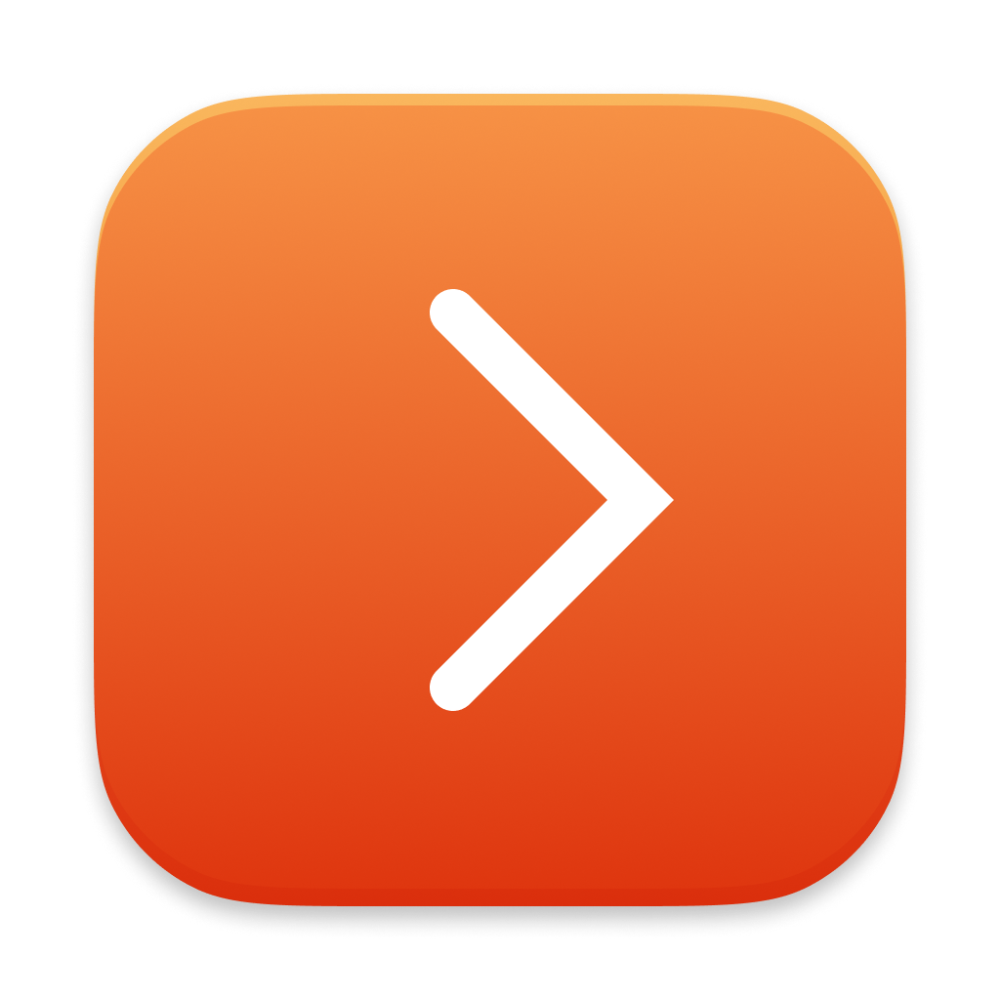

# Less



A tiny macOS menu bar app that hides your other menu bar items behind a single chevron.

Tired of a crowded menu bar? Less adds a small toggle button -- click once and everything to its right disappears, click again to bring it all back. Cmd-drag the button to position it anywhere in the menu bar; whatever sits to its right is what gets hidden.

**Requires macOS 15 (Sequoia) or later.**

<video src="web/less.mp4" width="800" autoplay loop muted playsinline></video>

## Install

1. Open **Terminal** (press ⌘Space, type "Terminal", press Enter)
2. Copy and paste this command, then press Enter:

```sh
/bin/bash -c "$(curl -fsSL https://raw.githubusercontent.com/vladstudio/less/main/install.sh)"
```

3. The app will install to /Applications and open automatically

## Tips

- Right-click the toggle for the menu (Start on Login, Quit)
- The toggle position is saved automatically -- drag it once and it stays put
- The first item to the right of the toggle is the first one hidden; place it accordingly

---

License: MIT
